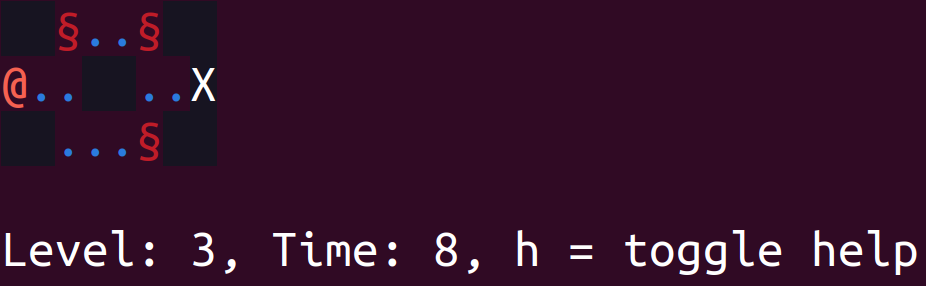

# didu
Diamand Duo is a 2D ascii based termial game.



The goal is to move the player, represented by the character "@"
to the exit, represented by the character "X".


Move the player by using the arrow keys.
Get help by pressing "h".
Exit with "Esc" Key.
Restart with "r".

# instalation

This is a game written in rust. You need the cargo toolchain for it.
You can download it here: [rust-lang.org](https://www.rust-lang.org/tools/install).

After the installation, you can run it using:
```bash
cargo install cargo-tarpaulin
cargo run
```

# Tests
```bash
cargo test
```

# Test coverage
```bash
cargo install cargo-tarpaulin
cargo tarpaulin --out Xml

```
You may need to close the terminal after the game is finished.

# Game mechanics

## Cells
The player is moved on a grid. 
This grid is later rendered onto the terminal.

### Empty
This is empty space in the game that you can run on.
It is represented by the "." character.

### Player
The player is represented by "@". 
You can move the plyer by using the arrow keys.
When the player can't be found anymore on the map, the level will be restarted.

### Exit
The player should be moved to the exit, marked as "X".

### Horizonal / Vertical Wall
Walls can not be passed. They are represented as "-" and "|".

### Counter Clockwise Enemies
They are represented by "§" and rotate counter clockwise when they hit a obsticle.

### Void
Represented as empty Space, that can only be passed when eaten a invincibility cookie before.

### Doors and Swiches
Running over a switch ("S") will open (remove) the doors ("D") that is connected to it.

### OneWayTeleporter
Moves the player to a point on the map, represented by "T".

### Breakable Ground
Can be run over once in the State ("?") and than changes to Void (" ").

### Invincibility
Allows the player to move over Void and attack enemies.
The Player will transfer into a number, where the amount of left moves
in the invincible state is displayed.


